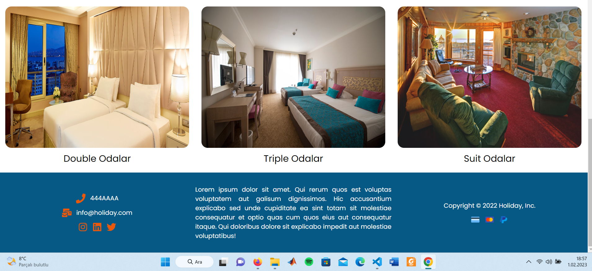
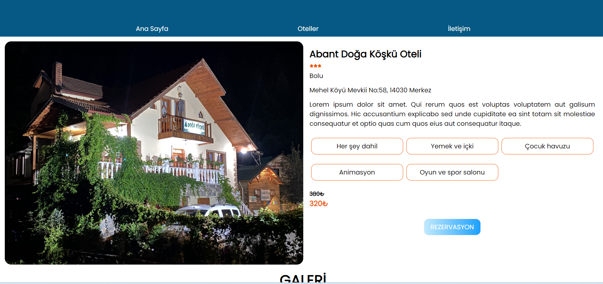

<<<<<<< HEAD

# HotelWebSite

<<<<<<< HEAD
## [NETLIFY LİNKİ](https://63dbd0102436936547f3b3af--hotelwebsitereact.netlify.app/)
=======

## [NETLIFY LİNKİ](https://hotelwebsitereact.netlify.app/)

>>>>>>> 7bc1e8731ca66b2853a48163f7780f1671179b09

## EXAMPLE DATA IN data/hotels.js

```
 {
    id: '0248058a-27e4-11e6-ace6-a9876eff01b3',
    type: 'hotel',
    name: 'Abant Doğa Köşkü Oteli',
    address1: 'Mehel Köyü Mevkii No:58, 14030 Merkez',
    city: 'Bolu',
    location: {
      latitude: 47.60985,
      longitude: -122.33475,
    },
    shortDescription:
      'Lorem ipsum dolor sit amet. Qui rerum quos est voluptas voluptatem aut galisum dignissimos. Hic accusantium explicabo sed unde cupiditate ea sint totam sit molestiae consequatur et optio quas cum quos eius aut consequatur itaque.',
    mainPhoto: require('../assets/otels/abantDoğaKöşküOteli.jpeg'),
    gallery: [
      {path: require('../assets/facilities/tesis1.jpg')},
      {path: require('../assets/facilities/tesis2.jpg')},
      {path: require('../assets/facilities/tesis3.jpg')},
      {path: require('../assets/facilities/tesis4.jpg')},
      {path: require('../assets/facilities/tesis5.jpg')},
    ],
    price: '380₺',
    discounted: '320₺',
    numberOfStars: 3,
    advantages: [
      'Her şey dahil',
      'Yemek ve içki',
      'Çocuk havuzu',
      'Animasyon',
      'Oyun ve spor salonu',
    ],
  },
```




 <br />
 <br />



 <br />
 <br />


